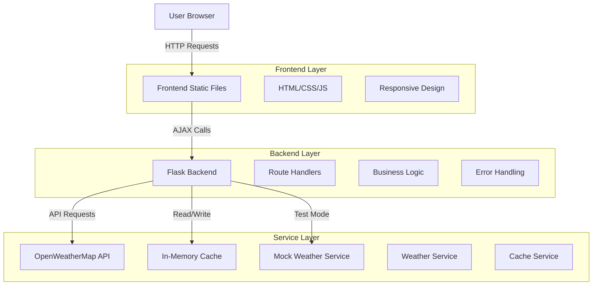
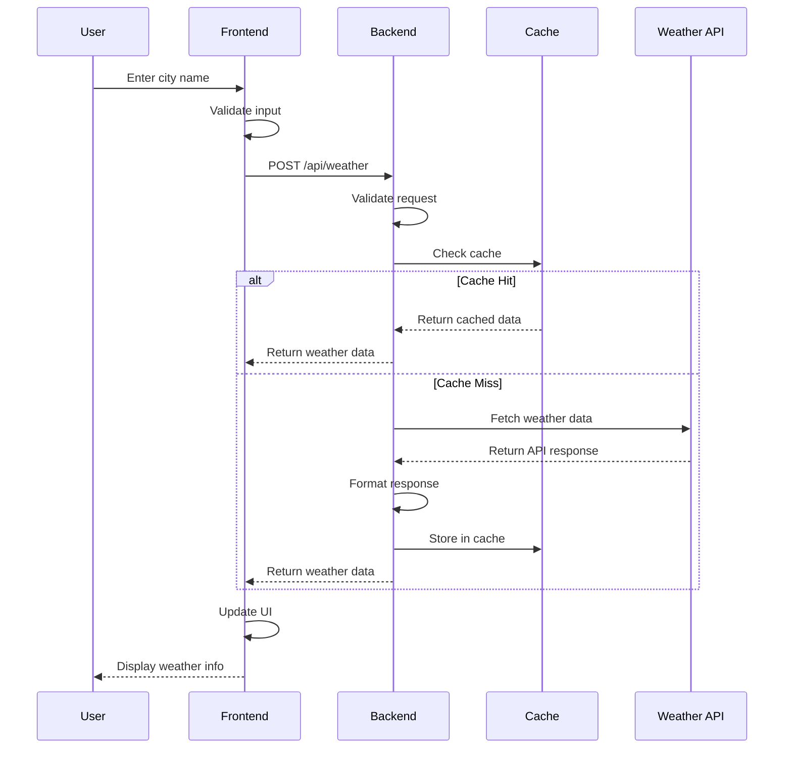
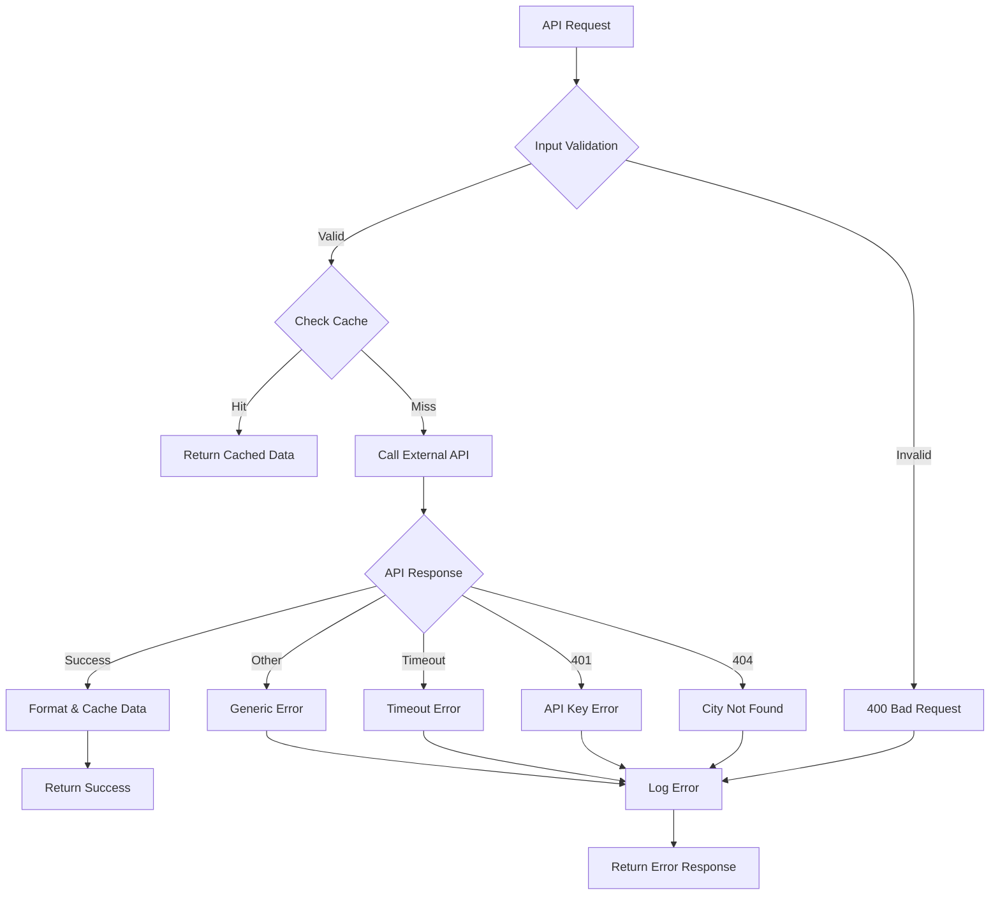

# Architecture Documentation

Detailed technical architecture for the Weather Dashboard application.

## System Overview

The Weather Dashboard is a modern web application built with a clear separation between frontend and backend components, following RESTful API principles and implementing efficient caching strategies.

## High-Level Architecture



---

## Component Architecture

### Frontend Architecture

**Technology Stack:**
- HTML5 with semantic elements
- CSS3 with Flexbox and Grid
- Vanilla JavaScript (ES6+)
- Font Awesome icons
- Google Fonts (Inter)

**Component Structure:**
```
frontend/
├── index.html          # Main application shell
├── style.css           # Styles and responsive design
└── script.js           # Application logic and API interactions
```

**Key Design Patterns:**
- **Mobile-First Design**: Responsive layout starting from mobile breakpoints
- **Progressive Enhancement**: Core functionality works without JavaScript
- **Separation of Concerns**: HTML structure, CSS presentation, JS behavior

### Backend Architecture

**Flask Application Structure:**
```
backend/
├── app.py              # Main Flask application
├── config.py           # Configuration management
├── requirements.txt    # Python dependencies
└── services/
    ├── __init__.py
    ├── weather_service.py      # OpenWeatherMap integration
    ├── mock_weather_service.py # Test data provider
    └── cache_service.py        # In-memory caching
```

**Design Patterns Implemented:**
- **Service Layer Pattern**: Business logic separated into service classes
- **Configuration Pattern**: Centralized configuration management
- **Repository Pattern**: Data access abstraction (cache service)

---

## Data Flow Architecture

### Request Processing Flow



### Error Handling Flow



---

## Service Layer Architecture

### Weather Service

**Purpose**: Handle all weather data fetching and processing

**Key Methods:**
```python
class WeatherService:
    def get_weather_by_city(city: str, units: str) -> dict
    def get_forecast_by_city(city: str, units: str, days: int) -> dict
    def _format_weather_response(data: dict, units: str) -> dict
    def _convert_temperature(temp: float, from_unit: str, to_unit: str) -> float
```

**Responsibilities:**
- OpenWeatherMap API integration
- Data formatting and normalization
- Error handling and retry logic
- Temperature unit conversions

### Cache Service

**Purpose**: Provide high-performance in-memory caching

**Key Features:**
```python
class CacheService:
    def get(key: str) -> Optional[Any]
    def set(key: str, value: Any, ttl: int) -> None
    def delete(key: str) -> bool
    def cleanup_expired() -> int
    def get_stats() -> Dict[str, Any]
```

**Responsibilities:**
- TTL-based cache management
- Thread-safe operations
- Memory usage optimization
- Cache statistics and monitoring

### Mock Weather Service

**Purpose**: Provide test data for development and testing

**Benefits:**
- No API key required for development
- Consistent test data
- No rate limiting
- Faster development iteration

---

## Data Models

### Weather Data Model

```python
WeatherResponse = {
    'status': 'success' | 'error',
    'data': {
        'city': str,                    # "London, GB"
        'coordinates': {
            'lat': float,               # Latitude
            'lon': float                # Longitude
        },
        'current': {
            'temperature': float,       # Current temperature
            'feels_like': float,        # "Feels like" temperature
            'temp_min': float,          # Minimum temperature
            'temp_max': float,          # Maximum temperature
            'humidity': int,            # Humidity percentage
            'pressure': int,            # Atmospheric pressure
            'description': str,         # Weather description
            'icon': str,               # Weather icon code
            'wind_speed': float,       # Wind speed
            'wind_direction': int,     # Wind direction in degrees
            'visibility': int,         # Visibility in meters
            'uv_index': float         # UV index (if available)
        },
        'units': {
            'temperature': str,        # "°C", "°F", "K"
            'wind_speed': str,         # "m/s", "mph"
            'pressure': str           # "hPa", "inHg"
        },
        'sun': {
            'sunrise': str,           # ISO 8601 timestamp
            'sunset': str            # ISO 8601 timestamp
        },
        'timestamp': str,            # ISO 8601 timestamp
        'cached': bool              # Whether data came from cache
    },
    'message': str                  # Error message (if status = 'error')
}
```

### Cache Entry Model

```python
CacheEntry = {
    'value': Any,                   # Cached data
    'expires_at': float,           # Unix timestamp
    'created_at': float           # Unix timestamp
}
```

---

## Security Architecture

### Configuration Security

**Environment Variables:**
- Sensitive data stored in environment variables
- `.env` file excluded from version control
- Configuration validation on startup

**API Key Management:**
- OpenWeatherMap API key required
- Key validation during service initialization
- Graceful degradation to test mode if key missing

### Input Validation

**Client-Side Validation:**
```javascript
function validateCityInput(city) {
    if (!city || city.trim().length < 2) {
        throw new Error('City name must be at least 2 characters');
    }
    return city.trim();
}
```

**Server-Side Validation:**
```python
def validate_weather_request(request_data):
    if not request_data or 'city' not in request_data:
        raise ValueError('City name is required')
    
    city = request_data['city'].strip()
    if not city or len(city) < 2:
        raise ValueError('Invalid city name')
    
    return city
```

### Error Handling Security

**Information Disclosure Prevention:**
- Generic error messages for external API failures
- Detailed logging server-side only
- No stack traces in production responses

---

## Performance Architecture

### Caching Strategy

**Cache Layers:**
1. **In-Memory Cache**: 15-minute TTL for weather data
2. **Browser Cache**: Static assets cached via HTTP headers
3. **API Cache**: OpenWeatherMap has built-in caching

**Cache Key Strategy:**
```python
cache_key = f"{city.lower()}_{units}"
# Examples: "london_metric", "tokyo_imperial"
```

### API Optimization

**Request Optimization:**
- Single API call per city/units combination
- Timeout configuration (10 seconds default)
- Connection reuse for multiple requests

**Response Optimization:**
- Data formatting performed server-side
- Minimal payload size
- Efficient JSON serialization

### Frontend Performance

**Asset Optimization:**
- Minified CSS and JavaScript (production)
- External fonts loaded asynchronously
- Critical CSS inlined

**Runtime Optimization:**
- Debounced search input
- Efficient DOM queries
- Event delegation where appropriate

---

## Scalability Considerations

### Horizontal Scaling

**Stateless Design:**
- No session state stored in application
- Cache can be externalized (Redis, Memcached)
- Load balancer friendly

**Database Considerations:**
- Currently using in-memory cache only
- Easy migration to external cache layer
- Potential for database integration for user data

### Monitoring and Observability

**Logging Strategy:**
```python
# Structured logging for production
logger.info("Weather data fetched", extra={
    'city': city,
    'units': units,
    'response_time': response_time,
    'cache_hit': cache_hit
})
```

**Health Check Endpoint:**
```python
@app.route('/api/health')
def health_check():
    return {
        'status': 'healthy',
        'timestamp': datetime.utcnow().isoformat(),
        'cache_stats': cache_service.get_stats()
    }
```

---

## Technology Decisions

### Why Flask?
- **Lightweight**: Minimal overhead for simple API
- **Flexible**: Easy to extend and customize
- **Python Ecosystem**: Rich library support
- **Development Speed**: Quick prototyping and development

### Why In-Memory Caching?
- **Simplicity**: No external dependencies
- **Performance**: Fastest possible cache access
- **Development**: Easy to implement and debug
- **Scale**: Sufficient for small to medium applications

### Why Vanilla JavaScript?
- **No Build Process**: Simple deployment
- **Performance**: Direct browser execution
- **Learning**: Clear understanding of fundamentals
- **Maintenance**: No framework version dependencies

---

## Future Architecture Considerations

### Potential Enhancements

**Database Integration:**
```python
# User data, saved locations, preferences
from azure.cosmosdb import CosmosClient

class UserService:
    def save_user_location(self, user_id: str, location: dict)
    def get_user_preferences(self, user_id: str) -> dict
```

**External Cache:**
```python
# Redis for distributed caching
import redis

class RedisCacheService:
    def __init__(self):
        self.client = redis.Redis(host='cache-server')
```

**Real-time Features:**
```javascript
// WebSocket for real-time weather updates
const ws = new WebSocket('ws://localhost:5000/weather-updates');
```

**Microservices Architecture:**
```
API Gateway → Weather Service → OpenWeatherMap
           → User Service → Azure Cosmos DB
           → Cache Service → Redis
           → Notification Service → Push API
```

This architecture provides a solid foundation for both current functionality and future enhancements while maintaining simplicity and performance.